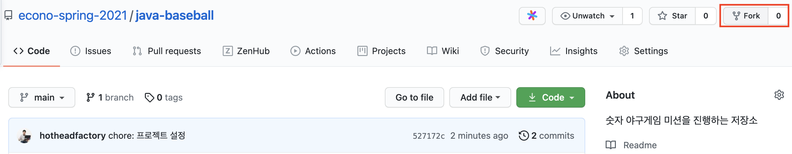
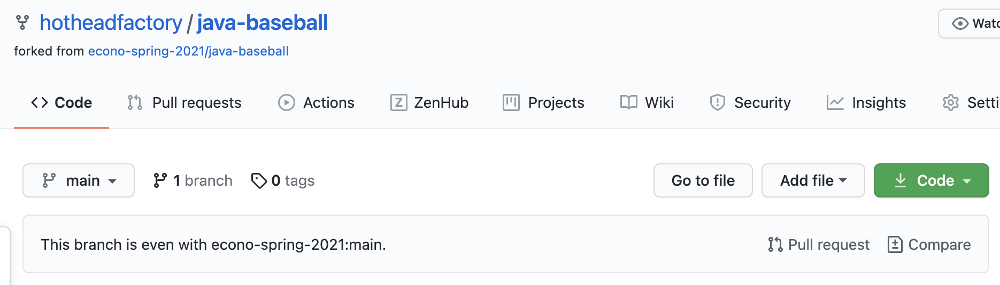
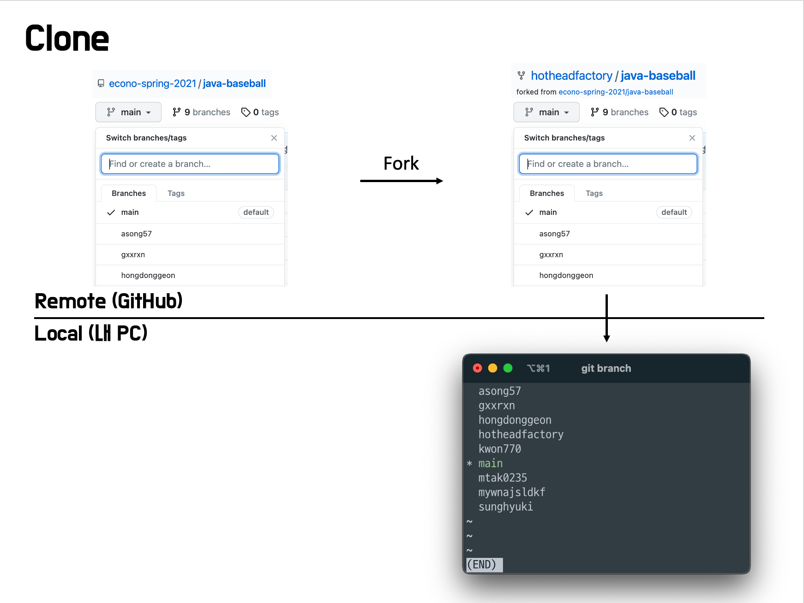
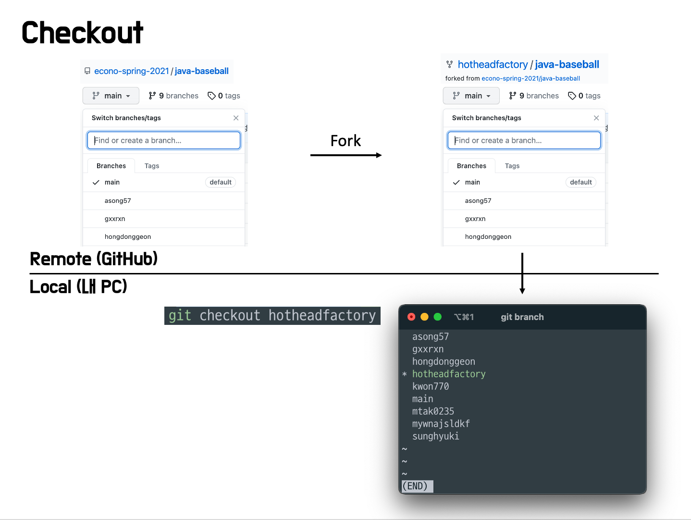
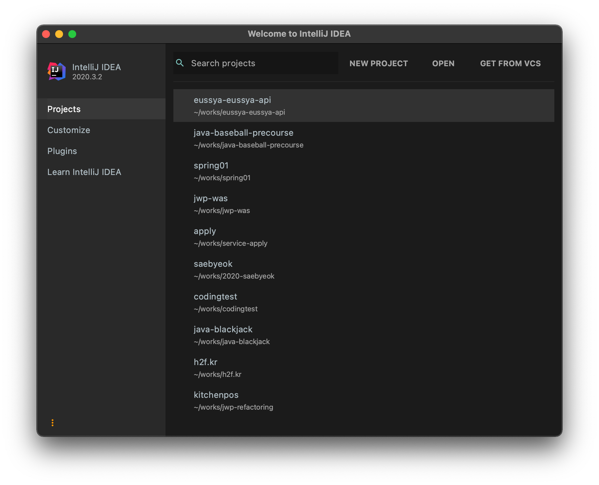
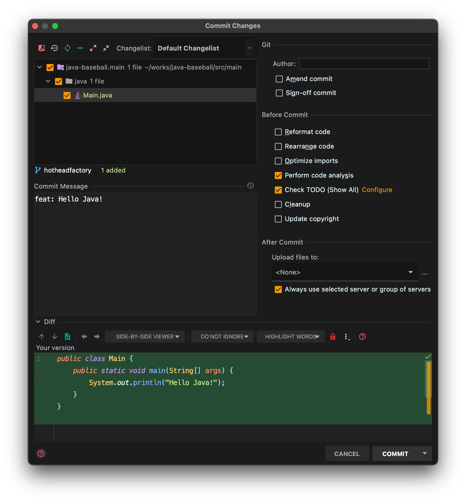
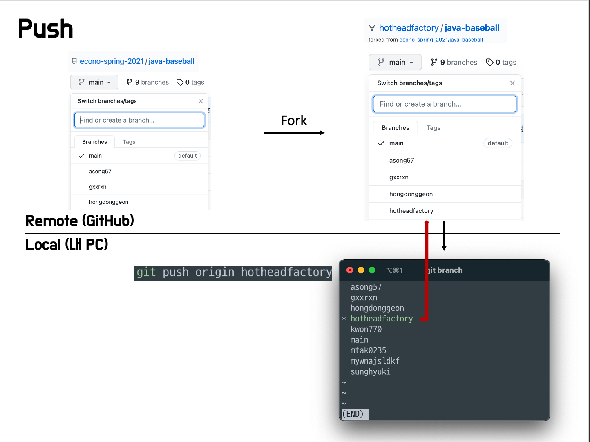
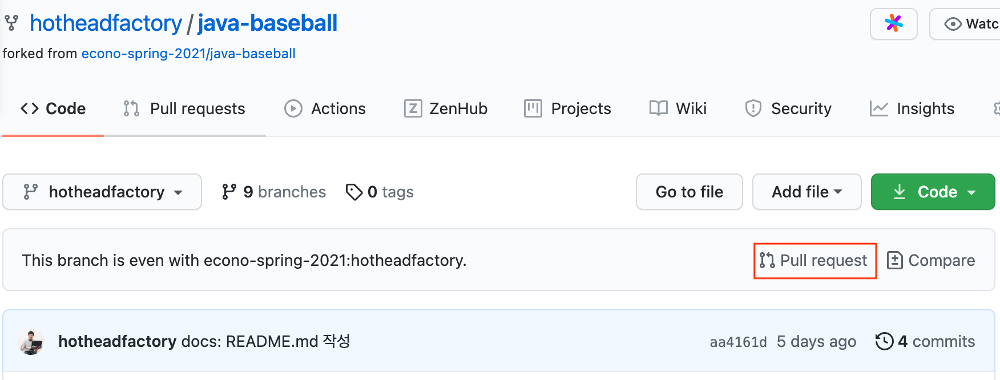
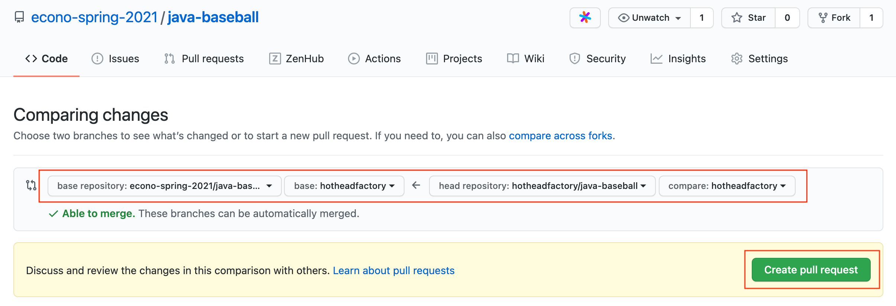
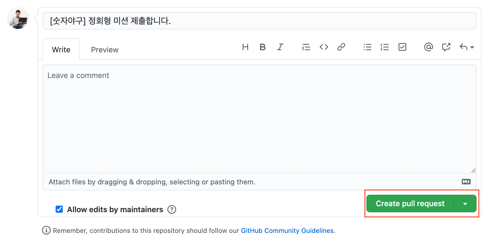

# 미션 제출 방법

1. 프로젝트를 자신의 계정으로 fork한다. 저장소 우측 상단의 fork 버튼을 클릭해 fork한다.

> 
> fork는 스프링 스터디 저장소를 자신의 계정으로 복사하는 기능이다. 앞으로 모든 미션은 자신의 계정 아래에 있는 저장소를 활용해 진행한다.

다음 그림과 같이 econo-spring-2021의 미션 저장소 우측 상단의 fork 버튼을 클릭해 fork한다.

fork 이후에는 다음과 같이 자신의 저장소에 미션이 저장된 것을 볼 수 있다.



---
2. fork한 저장소를 자신의 컴퓨터로 clone한 후 폴더로 이동한다.
> fork한 저장소는 github.com에 존재하기 때문에 소스 코드를 추가하고, 수정하는 작업을 할 수 없다.
>
> clone 명령은 github.com에 존재하는 저장소를 자신의 노트북 또는 PC로 복사하는 과정이다.

터미널을 켜고 (Windows는 Git Bash를 켜고) 프로젝트를 저장하길 원하는 디렉토리로 이동한 다음 다음 명령을 입력한다.

```
git clone https://github.com/{본인 아이디}/{저장소 아이디}.git
예) git clone https://github.com/hotheadfactory/java-baseball.git
```

```
// clone한 폴더로 이동하는 방법
cd {저장소 아이디}
ex) cd java-baseball
```

fork와 clone을 완료한 후의 저장소 상태를 그림으로 표현하면 다음과 같다.



---
3. 터미널에서 다음 명령을 입력해 자신의 브랜치로 이동한다.
```
git checkout {본인 아이디}
ex) git checkout hotheadfactory
```



---
4. IntelliJ로 가져오기(import)
* IntelliJ를 시작
* 다음 화면에서 OPEN 선택



* 앞에서 clone한 폴더를 선택하면 프로젝트를 불러올 수 있다.

---
5. 기능 구현
> 미션 요구사항을 파악해 기능을 구현한다.

---
6. 기능 구현 후 add, commit
> 기능 구현을 완료한 후 로컬 저장소에 변경된 부분을 반영하기 위해 add, commit 명령을 사용한다.

```
git status // 변경된 파일 확인
git add .(또는 -A) // 변경된 전체 파일을 한번에 반영
git commit -m "메시지" // 작업한 내용을 메시지에 기록
```

* 또는 IntelliJ 상에서 Cmd + K (Windows / Linux는 Control + K) 를 누르면 커밋 대화 상자가 뜨게 되는데, 여기서 GUI로 간편하게 커밋할 수 있다.



----

7. 본인 원격 저장소에 올리기

> 로컬에서 commit 명령을 실행하는 것만으로는 로컬 저장소에 반영될 뿐, 원격 github.com의 저장소에는 반영되지 않는다.

```
git push origin 브랜치이름
ex) git push origin javajigi
```

push 명령을 실행한 후의 상태는 다음과 같다.


---
8. github 서비스에서 pull request를 보낸다.
> pull request는 github에서 제공하는 기능으로 코드리뷰 요청을 보낼 때 사용한다.
> 

```
ex) 미션을 진행한 hotheadfactory/java-baseball hotheadfactory 브랜치 => econo-spring-2021/java-baseball hotheadfactory 브랜치로 pull request를 보낸다.
```

* 브라우저에서 github 저장소에 접근한다.
* 브랜치를 자신의 아이디로 되어 있는 작업 브랜치로 변경한다(앞 단계의 예에서는 hotheadfactory).
* 아래쪽의 "Pull request" 버튼을 클릭한다.



* 현재 미션에서 작업한 내용을 입력하고 "Create pull request" 버튼을 클릭해 pull request를 작성한 뒤, 다시 "Create pull request" 를 누른다.





* Pull Requests 탭으로 가서 자신의 PR이 올바르게 추가되었는지 확인한다.